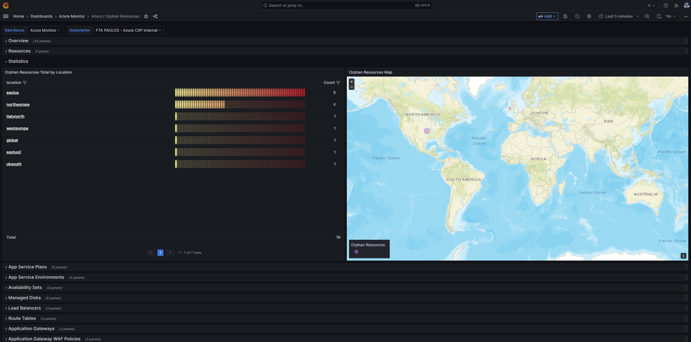

# Azure Orphan Resources Grafana Dashboard

In cloud computing, it is crucial to follow best practices when building a reliable, high-performing, and secure environment. However, it is equally important to implement a strategy aimed at reducing the total cost of ownership. In this context, this Grafana dashboard offers a centralized view of Azure orphan resources that can be safely removed. By identifying and removing these unnecessary resources, you can effectively decrease the overall cost associated with maintaining their Azure subscriptions and increase the operational efficiency.

This dashboard is influenced by the [Azure Orphaned Resources 2.0](https://github.com/dolevshor/azure-orphan-resources/tree/main) project developed by my colleague Dolev Shor. It incorporates and integrates some of the queries he designed for his Azure workbook, which can be created and utilized within the Azure Portal. You can refer to the [Azure workbook documentation](https://learn.microsoft.com/en-us/azure/azure-monitor/visualize/workbooks-overview) to learn more about creating and utilizing workbooks in the Azure Portal.

## Prerequisites

You can host the Grafana dashboard in Azure Managed Grafana, your own Grafana installation in an AKS cluster, or any Kubernetes cluster with access to the public internet.

## Implementation

The dashboard performs a series of queries using the [Kusto Query Language](https://learn.microsoft.com/en-us/azure/data-explorer/kusto/query/) and [Azure Resource Graph](https://learn.microsoft.com/en-us/azure/governance/resource-graph/overview) to individuate unused, orphan resources that can be safely removed from your Azure subscriptions without impacting the operability of your cloud hosted workloads. Azure Resource Graph is an Azure service designed to extend Azure Resource Management by providing efficient and performant resource exploration with the ability to query at scale across a given set of subscriptions so that you can effectively govern your environment.

For more information Azure Resource Graph, you can refer to the following links:

- [Azure Resource Graph Overview](https://learn.microsoft.com/en-us/azure/governance/resource-graph/overview)
- [Query Resource Changes](https://learn.microsoft.com/en-us/azure/governance/resource-graph/how-to/get-resource-changes)

Here is the list of the resources currently supported by the dashboard:

- App Service Plans
- App Service Environments
- Availability Sets
- Managed Disks
- Load Balancers
- Route Tables
- Application Gateways
- Application Gateway WAF Policies
- Front Door WAF Policies
- Traffic Manager Profiles
- Virtual Networks
- Subnets
- Network Interfaces
- Virtual Network Gateways
- Network Security Groups
- NAT Gateways
- Public IP Addresses
- Public IP Prefixes
- IP Groups
- Private DNS Zones
- Private Endpoints
- Private Link Services
- SQL Elastic Pools
- Resource Groups

Please note that all the resources mentioned above come with an associated cost. Some resources like Availability Sets, Route Tables, Subnets, IP Groups, and Resource Groups are available free of charge.

## Importing the dashboard into Azure Managed Grafana

To import the dashboard into [Azure Managed Grafana](https://learn.microsoft.com/en-us/azure/managed-grafana/overview), follow these steps:

1. Go to the Azure Portal and navigate to your Azure Managed Grafana resource.
2. Click `Identity` under `Settings`.
3. Ensure that the system-assigned managed identity is enabled.
  
4. Click on the `Azure role assignments` button.
5. Assign the [Monitoring Reader](https://learn.microsoft.com/en-us/azure/azure-monitor/roles-permissions-security#monitoring-reader) role to the Grafana managed identity, scoped to your Azure subscription or Management Group.
  
6. Click on the `Endpoint` URL on the `Overview` page of your Azure Managed Grafana resource.
7. In the Grafana dashboard, go to `Connections` and ensure that you have an `Azure Monitor` datasource. If not, create one and select `Managed Identity` as the authentication mechanism.
8. Click on the `Load subscriptions` button to test the data source.
9. Go to `Dashboards`, click on `New`, and then select `Import`.
10. Upload the dashboard JSON file or copy and paste the JSON code into the textbox, then click the `Load` button.
  
11. Choose a category for the dashboard and click the `Import` button.
  [Upload Dashboard to Azure Managed Grafana](./images/managed-grafana-import-dashboard-02.png)

## Importing the Dashboard into a Bring Your Own (BYO) Grafana Installation

Before importing the dashboard into your own Grafana installation, you need to create a service principal under your Microsoft Azure AD account and assign the [Monitoring Reader](https://learn.microsoft.com/en-us/azure/azure-monitor/roles-permissions-security#monitoring-reader) role to it. Once done, follow these steps:

1. In the Grafana dashboard, go to `Connections` and ensure that you have an `Azure Monitor` datasource. If not, create one and specify the `tenant id`, `client Id`, and `client secret` of your service princiapl as shown in the following picture:
  
2. Click on the `Load subscriptions` button to test the data source.
3. Go to `Dashboards`, click on `New`, and then select `Import`.
4. Upload the dashboard JSON file or copy and paste the JSON code into the textbox, then click the `Load` button.
  
5. Choose a category for the dashboard and click the `Import` button.
  

